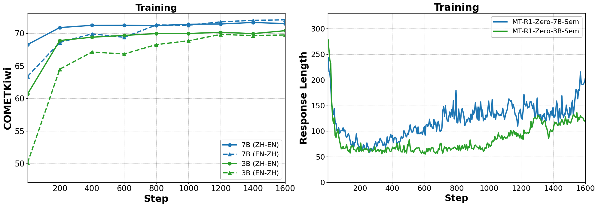
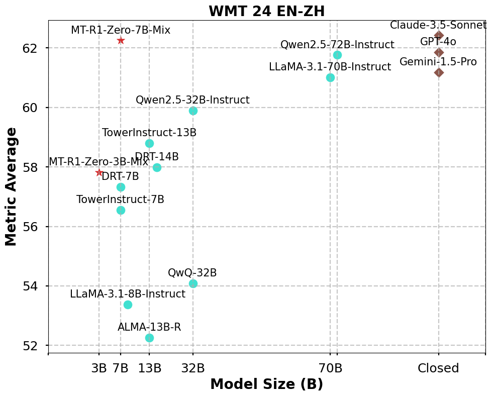

# MT-R1-Zero: Advancing LLM-based Machine Translation via R1-Zero-like Reinforcement Learning

<a href='https://arxiv.org/abs/2504.10160'></a> &nbsp;


## Overview **📚**


Welcome to the official repository for **MT-R1-Zero**, the first open-source adaptation of the R1-Zero Reinforcement Learning (RL) paradigm for Machine Translation (MT). MT-R1-Zero achieves highly competitive translation quality without supervised fine-tuning or cold-start data by using the **Rule-Metric Mixed Reward** mechanism that guides LLMs via feedback from metrics like BLEU and COMETKiwi. Our 7B parameter models demonstrate performance on par with or exceeding advanced models on WMT'24 EN-ZH benchmarks. We observed many interesting findings during the training process, which we invite you to explore in our paper. This work highlights the potential of pure, metric-guided RL for advancing Natural Language Generation tasks. 

The training dynamics are fascinating! We strongly encourage you to try our code firsthand.





## News 📢
- **[2025/04/15] Our paper is released on arxiv: [[2504.10160] MT-R1-Zero: Advancing LLM-based Machine Translation via R1-Zero-like Reinforcement Learning ](https://arxiv.org/abs/2504.10160)  **
- **[2025/04/14] We release the code and data of MT-R1-Zero**

## **Environment Setup 🔧**


```bash
conda create -n mtzero python=3.10
conda activate mtzero
```

```bash
pip install torch==2.4.0 --index-url https://download.pytorch.org/whl/cu124
pip3 install vllm==0.6.3 ray
pip3 install flash-attn --no-build-isolation
pip install -e . 
pip install wandb IPython matplotlib sacrebleu sacrebleu[ja] unbabel-comet
```

## Data Preparation 📦

Our training process uses parallel corpora with the following structure:

```json
{
	"data_source": "train",
	 "lg": "en-zh", 
	 "en": "I love machine translation.", 
	 "zh": "我爱机器翻译。"
}
```

You can either use the data provided in the `/data` directory or process your own data with:

```bash
python3 data/process_data.py \
    --train_files "data/train/json/train_zhen_6565.jsonl" "data/train/json/train_enzh_6565.jsonl" \
    --test_files "data/test/json/wmt23_zhen.jsonl" "data/test/json/wmt24_enzh.jsonl" \
    --template_type "base" \
    --train_output_file ${train_file_path} \
    --test_output_file ${test_file_path}
```

For more details, please refer to `data/process_data.py`.

## GRPO Training 🎬️

```bash
conda activate mtzero
bash main_grpo.sh
```

Parameters:

- `model_path`: Path to your base model
- `train_file_path`: Path to processed training data in parquet format
- `test_file_path`: Path to processed test data in parquet format
- `comet_model_path`: Path to the reference-based metric checkpoint(e.g., XCOMET, COMET-22)
- `comet_free_model_path`: Path to the reference-free metric checkpoint (e.g., COMETKiwi, XCOMET)
- `train_batch_size`: Training batch size (default: 8)
- `rollout_num`: Number of generated samples for each input during training (default: 8)
- `comet_rm`: Whether to use reference-based COMET as reward (True/False)
- `comet_free_rm`: Whether to use reference-free COMETKiwi as reward (True/False)
- `reward_metric`: Type of metric reward  to use ('Model', 'BLEU', or 'Merge'):
    - 'Model': When using COMET-based metrics (`comet_rm` or `comet_free_rm` is True)
    - 'BLEU': When using BLEU as the metric reward
    - 'Merge': When using a combination of BLEU and COMETKiwi as metric rewards
    
    If you want to support larger models, you can increase `tensor_model_parallel_size`. 
    
    We have successfully run our code on 4xH800 (7B) and 4xA40 (3B) GPUs. 
    

## Evaluation 🎰

First, replace `BASE_MODEL_NAME`, `BASE_PATH`, `BASE_SAVE_DIR`, `comet_model_path`, and `comet_free_model_path` in `main_inference_eval.sh` with your paths.

```bash
conda activate mtzero
bash main_inference_eval.sh
```

## Citation **📝**

```bash
@misc{feng2025mtr1zero,
      title={MT-R1-Zero: Advancing LLM-based Machine Translation via R1-Zero-like Reinforcement Learning}, 
      author={Zhaopeng Feng and Shaosheng Cao and Jiahan Ren and Jiayuan Su and Ruizhe Chen and Yan Zhang and Zhe Xu and Yao Hu and Jian Wu and Zuozhu Liu},
      year={2025},
      eprint={2504.10160},
      archivePrefix={arXiv},
      primaryClass={cs.CL},
      url={https://arxiv.org/abs/2504.10160}, 
}
```